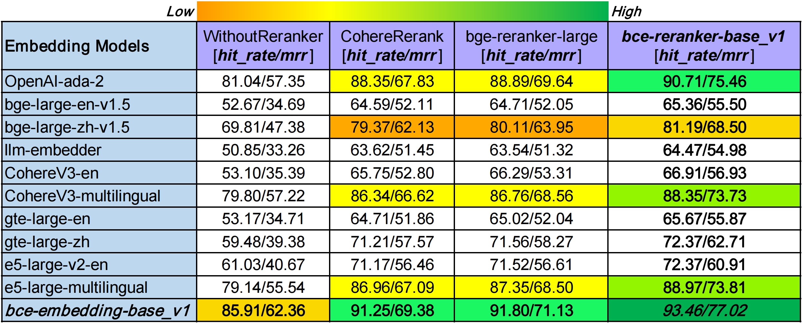

<!--
 * @Description: 
 * @Author: shenlei
 * @Modified: linhui
 * @Date: 2023-12-19 10:31:41
 * @LastEditTime: 2024-01-05 15:23:31
 * @LastEditors: shenlei
-->
<h1 align="center">BCEmbedding: Bilingual and Crosslingual Embedding for RAG</h1>

<div align="center">
    <a href="./LICENSE">
      
    </a>
    &nbsp;&nbsp;&nbsp;&nbsp;
    <a href="https://twitter.com/YDopensource">
      
    </a>
    &nbsp;&nbsp;&nbsp;&nbsp;
</div>
<br>

<p align="center">
  <a href="./README.md" target="_Self">English</a>
  |
  <strong style="background-color: green;">简体中文</strong>
</p>

<details open="open">
<summary>点击打开目录</summary>

- <a href="#-双语和跨语种优势" target="_Self">🌐 双语和跨语种优势</a>
- <a href="#-主要特点" target="_Self">💡 主要特点</a>
- <a href="#-最新更新" target="_Self">🚀 最新更新</a>
- <a href="#-模型列表" target="_Self">🍎 模型列表</a>
- <a href="#-使用指南" target="_Self">📖 使用指南</a>
  - <a href="#安装" target="_Self">安装</a>
  - <a href="#快速使用" target="_Self">快速使用(`transformers`, `sentence-transformers`)</a>
- <a href="#%EF%B8%8F-模型评测" target="_Self">⚙️ 模型评测</a>
  - <a href="#基于mteb的语义表征评测说明" target="_Self">基于MTEB的语义表征评测说明</a>
  - <a href="#基于llamaindex的rag评测说明" target="_Self">基于LlamaIndex的RAG评测说明</a>
- <a href="#-指标排行榜" target="_Self">📈 指标排行榜</a>
  - <a href="#基于mteb的语义表征评测指标" target="_Self">基于MTEB的语义表征评测指标</a>
  - <a href="#基于llamaindex的rag评测指标" target="_Self">基于LlamaIndex的RAG评测指标</a>
- <a href="#-有道bcembedding-api" target="_Self">🛠 有道BCEmbedding API</a>
- <a href="#-技术交流群" target="_Self">🧲 技术交流群</a>
- <a href="#%EF%B8%8F-引用说明" target="_Self">✏️ 引用说明</a>
- <a href="#-许可说明" target="_Self">🔐 许可说明</a>
- <a href="#-相关链接" target="_Self">🔗 相关链接</a>

</details>
<br>

`BCEmbedding`是由网易有道开发的双语和跨语种语义表征算法模型库，其中包含`EmbeddingModel`和`RerankerModel`两类基础模型。`EmbeddingModel`专门用于生成语义向量，在语义搜索和问答中起着关键作用，而`RerankerModel`擅长优化语义搜索结果和语义相关顺序精排。

`BCEmbedding`作为有道的检索增强生成式应用（RAG）的基石，特别是在[QAnything](http://qanything.ai) [[github](https://github.com/netease-youdao/qanything)]中发挥着重要作用。QAnything作为一个网易有道开源项目，在有道许多产品中有很好的应用实践，比如[有道速读](https://read.youdao.com/#/home)和[有道翻译](https://fanyi.youdao.com/download-Mac?keyfrom=fanyiweb_navigation)。

`BCEmbedding`以其出色的双语和跨语种能力而著称，在语义检索中消除中英语言之间的差异，从而实现：
- **强大的双语和跨语种语义表征能力【<a href="#基于mteb的语义表征评测指标" target="_Self">基于MTEB的语义表征评测指标</a>】。**
- **基于LlamaIndex的RAG评测，表现SOTA【<a href="#基于llamaindex的rag评测指标" target="_Self">基于LlamaIndex的RAG评测指标</a>】。**

## 🌐 双语和跨语种优势

现有的单个语义表征模型在双语和跨语种场景中常常表现不佳，特别是在中文、英文及其跨语种任务中。`BCEmbedding`充分利用有道翻译引擎的优势，实现只需一个模型就可以在单语、双语和跨语种场景中表现出卓越的性能。

`EmbeddingModel`支持***中文和英文***（之后会支持更多语种）；`RerankerModel`支持***中文，英文，日文和韩文***。

## 💡 主要特点

- **双语和跨语种能力**：基于有道翻译引擎的强大能力，`BCEmbedding`实现强大的中英双语和跨语种语义表征能力。

- **RAG适配**：面向RAG做针对性优化，可适配大多数相关任务，比如**翻译，摘要，问答**等。此外，针对 **问题理解（query understanding）** 也做了针对优化。详见 <a href="#基于llamaindex的rag评测指标" target="_Self">基于LlamaIndex的RAG评测指标</a>。

- **高效且精确的语义检索**：`EmbeddingModel`采用双编码器，可以在第一阶段实现高效的语义检索。`RerankerModel`采用交叉编码器，可以在第二阶段实现更高精度的语义顺序精排。

- **更好的领域泛化性**：为了在更多场景实现更好的效果，我们收集了多种多样的领域数据。

- **用户友好**：语义检索时不需要特殊指令前缀。也就是，你不需要为各种任务绞尽脑汁设计指令前缀。

- **有意义的重排序分数**：`RerankerModel`可以提供有意义的语义相关性分数（不仅仅是排序），可以用于过滤无意义文本片段，提高大模型生成效果。

- **产品化检验**：`BCEmbedding`已经被有道众多产品检验。

## 🚀 最新更新

- ***2024-01-03***: **模型发布** - [bce-embedding-base_v1](https://huggingface.co/maidalun1020/bce-embedding-base_v1)和[bce-reranker-base_v1](https://huggingface.co/maidalun1020/bce-reranker-base_v1)已发布.
- ***2024-01-03***: **RAG评测数据** [[CrosslingualMultiDomainsDataset](https://huggingface.co/datasets/maidalun1020/CrosslingualMultiDomainsDataset)] - 基于[LlamaIndex](https://github.com/run-llama/llama_index)的RAG评测数据已发布。
- ***2024-01-03***: **跨语种语义表征评测数据** [[详情](./BCEmbedding/evaluation/c_mteb/Retrieval.py)] - 基于[MTEB](https://github.com/embeddings-benchmark/mteb)的跨语种评测数据已发布.

## 🍎 模型列表

| 模型名称 | 模型类型 | 支持语种 | 参数量 | 开源权重 |  
|:-------------------------------|:--------:|:--------:|:--------:|:--------:|  
| bce-embedding-base_v1 | `EmbeddingModel` | 中英 | 279M | [Huggingface](https://huggingface.co/maidalun1020/bce-embedding-base_v1), [国内ModelScope](https://www.modelscope.cn/models/maidalun/bce-embedding-base_v1/summary) |  
| bce-reranker-base_v1 | `RerankerModel` | 中英日韩 | 279M | [Huggingface](https://huggingface.co/maidalun1020/bce-reranker-base_v1), [国内ModelScope](https://www.modelscope.cn/models/maidalun/bce-reranker-base_v1/summary) |  

## 📖 使用指南

### 安装

首先创建一个conda环境并激活
```bash
conda create --name bce python=3.10 -y
conda activate bce
```

然后最简化安装`BCEmbedding`:
```bash
pip install BCEmbedding==0.0.8
```

也可以通过项目源码安装:
```bash
git clone git@github.com:netease-youdao/BCEmbedding.git
cd BCEmbedding
pip install -v -e .
```

### 快速使用

#### 1. 基于`transformers`

通过`BCEmbedding`调用`EmbeddingModel`。[pooler](./BCEmbedding/models/embedding.py#L24)默认是`cls`。
```python
from BCEmbedding import EmbeddingModel

# list of sentences
sentences = ['sentence_0', 'sentence_1', ...]

# init embedding model
model = EmbeddingModel(model_name_or_path="maidalun1020/bce-embedding-base_v1")

# extract embeddings
embeddings = model.encode(sentences)
```

通过`BCEmbedding`调用`RerankerModel`可以计算句子对的语义相关分数，也可以对候选检索见过进行排序。
```python
from BCEmbedding import RerankerModel

# your query and corresponding passages
query = 'input_query'
passages = ['passage_0', 'passage_1', ...]

# construct sentence pairs
sentence_pairs = [[query, passage] for passage in passages]

# init reranker model
model = RerankerModel(model_name_or_path="maidalun1020/bce-reranker-base_v1")

# method 0: calculate scores of sentence pairs
scores = model.compute_score(sentence_pairs)

# method 1: rerank passages
rerank_results = model.rerank(query, passages)
```

#### 2. 基于`sentence_transformers`

`EmbeddingModel`调用方法：
```python
from sentence_transformers import SentenceTransformer

# list of sentences
sentences = ['sentence_0', 'sentence_1', ...]

# init embedding model
model = SentenceTransformer("maidalun1020/bce-embedding-base_v1")

# set max_length to 512 to avoid an error.
model.max_seq_length = 512

# extract embeddings
embeddings = model.encode(sentences, normalize_embeddings=True)
```

`RerankerModel`调用方法：
```python
from sentence_transformers import CrossEncoder

# init reranker model
model = CrossEncoder('maidalun1020/bce-reranker-base_v1', max_length=512)

# calculate scores of sentence pairs
scores = model.predict(sentence_pairs)
```


## ⚙️ 模型评测

### 基于MTEB的语义表征评测说明

我们基于[MTEB](https://github.com/embeddings-benchmark/mteb)和[C_MTEB](https://github.com/FlagOpen/FlagEmbedding/tree/master/C_MTEB)，提供`embedding`和`reranker`模型的语义表征评测工具。

首先安装 `MTEB`:
```
pip install mteb==1.1.1
```

#### 1. Embedding模型

运行下面命令评测`your_embedding_model`（比如，`maidalun1020/bce-embedding-base_v1`）。评测任务将会在**单语种，双语种和跨语种**（比如，`["en", "zh", "en-zh", "zh-en"]`）模式下评测：

```bash
python BCEmbedding/tools/eval_mteb/eval_embedding_mteb.py --model_name_or_path maidalun1020/bce-embedding-base_v1 --pooler cls
```

评测包含 **"Retrieval"， "STS"， "PairClassification"， "Classification"， "Reranking"和"Clustering"** 这六大类任务的 ***114个数据集***。

***注意：***
- 所有模型的评测采用各自推荐的`pooler`。"jina-embeddings-v2-base-en"， "m3e-base"和"m3e-large"的 `pooler`采用`mean`，其他模型的`pooler`采用`cls`.
- "jina-embeddings-v2-base-en"模型在载入时需要`trust_remote_code`。

```bash
python BCEmbedding/tools/eval_mteb/eval_embedding_mteb.py --model_name_or_path {moka-ai/m3e-base | moka-ai/m3e-large} --pooler mean

python BCEmbedding/tools/eval_mteb/eval_embedding_mteb.py --model_name_or_path jinaai/jina-embeddings-v2-base-en --pooler mean --trust_remote_code
```

#### 2. Reranker模型

运行下面命令评测`your_reranker_model`（比如，`maidalun1020/bce-reranker-base_v1`）。评测任务将会在**单语种，双语种和跨语种**（比如，`["en", "zh", "en-zh", "zh-en"]`）模式下评测：

```bash
python BCEmbedding/tools/eval_mteb/eval_reranker_mteb.py --model_name_or_path maidalun1020/bce-reranker-base_v1
```

评测包含 **"Reranking"** 任务的 ***12个数据集***。

#### 3. 指标可视化工具

我们提供了`embedding`和`reranker`模型的指标可视化一键脚本，输出一个markdown文件，详见[Embedding模型指标汇总](./Docs/EvaluationSummary/embedding_eval_summary.md)和[Reranker模型指标汇总](./Docs/EvaluationSummary/reranker_eval_summary.md)。

```bash
python BCEmbedding/evaluation/mteb/summarize_eval_results.py --results_dir {your_embedding_results_dir | your_reranker_results_dir}
```

### 基于LlamaIndex的RAG评测说明

[LlamaIndex](https://github.com/run-llama/llama_index)是一个著名的大模型应用的开源工具，在RAG中很受欢迎。最近，[LlamaIndex博客](https://blog.llamaindex.ai/boosting-rag-picking-the-best-embedding-reranker-models-42d079022e83)对市面上常用的embedding和reranker模型进行RAG流程的评测，吸引广泛关注。下面我们按照该评测流程验证`BCEmbedding`在RAG中的效果。

首先，安装LlamaIndex，并升级transformers到4.36.0：
```bash
pip install transformers==4.36.0

pip install llama-index==0.9.22
```

将您的"openai"和"cohere"的app key，以及openai base url（ openai官方接口"https://api.openai.com/v1" ）放到环境变量中：
```bash
export OPENAI_BASE_URL={openai_base_url}  # https://api.openai.com/v1
export OPENAI_API_KEY={your_openai_api_key}
export COHERE_APPKEY={your_cohere_api_key}
```

#### 1. 评测指标说明

- 命中率（Hit Rate）

  命中率计算的是在检索的前k个文档中找到正确答案的查询所占的比例。简单来说，它反映了我们的系统在前几次猜测中答对的频率。***该指标越大越好。***

- 平均倒数排名（Mean Reciprocal Rank，MRR）
  
  对于每个查询，MRR通过查看最高排名的相关文档的排名来评估系统的准确性。具体来说，它是在所有查询中这些排名的倒数的平均值。因此，如果第一个相关文档是排名最靠前的结果，倒数排名就是1；如果是第二个，倒数排名就是1/2，依此类推。***该指标越大越好。***

#### 2. 复现[LlamaIndex博客](https://blog.llamaindex.ai/boosting-rag-picking-the-best-embedding-reranker-models-42d079022e83)

为了公平起见，运行下面脚本，复现LlamaIndex博客的结果，将`BCEmbedding`与其他embedding和reranker模型进行对比分析：
```bash
# There should be two GPUs available at least.
CUDA_VISIBLE_DEVICES=0,1 python BCEmbedding/tools/eval_rag/eval_llamaindex_reproduce.py
```

运行下面命令，将指标汇总并分析：
```bash
python BCEmbedding/tools/eval_rag/summarize_eval_results.py --results_dir BCEmbedding/results/rag_reproduce_results
```

输出的指标汇总详见 ***[LlamaIndex RAG评测结果复现](./Docs/EvaluationSummary/rag_eval_reproduced_summary.md)***。从该复现结果中，可以看出：
- 在`WithoutReranker`设置下（**竖排对比**），`bce-embedding-base_v1`比其他embedding模型效果都要好。
- 在固定embedding模型设置下，对比不同reranker效果（**横排对比**），`bce-reranker-base_v1`比其他reranker模型效果都要好。
- ***`bce-embedding-base_v1`和`bce-reranker-base_v1`组合，表现SOTA。***

#### 3. 更好的领域泛化性

在上述的[LlamaIndex博客](https://blog.llamaindex.ai/boosting-rag-picking-the-best-embedding-reranker-models-42d079022e83)的评测数据只用了“llama2”这一篇文章，该评测是 **单语种，小数据量，特定领域** 的。为了兼容更真实更广的用户使用场景，评测算法模型的 **领域泛化性，双语和跨语种能力**，我们按照该博客的方法构建了一个多领域（计算机科学，物理学，生物学，经济学，数学，量化金融等，[详情](./BCEmbedding/tools/eval_rag/eval_pdfs/)）的双语种、跨语种评测数据，[CrosslingualMultiDomainsDataset](https://huggingface.co/datasets/maidalun1020/CrosslingualMultiDomainsDataset)。**为了保证构建数据的高质量，我们采用OpenAI的`gpt-4-1106-preview`。**

运行下面命令，对市面上各家开源、闭源的最强有力的embedding和reranker模型进行系统性评测：

```bash
# There should be two GPUs available at least.
CUDA_VISIBLE_DEVICES=0,1 python BCEmbedding/tools/eval_rag/eval_llamaindex_multiple_domains.py
```

运行下面命令，将指标汇总并分析：
```bash
python BCEmbedding/tools/eval_rag/summarize_eval_results.py --results_dir BCEmbedding/results/rag_results
```

输出的指标汇总详见：<a href="#1-多领域双语种和跨语种评测场景" target="_Self">多领域、双语种和跨语种评测场景</a>

## 📈 指标排行榜

### 基于MTEB的语义表征评测指标

#### 1. Embedding模型

| 模型名称 | Retrieval (47) | STS (19) | PairClassification (5) | Classification (21) | Reranking (12) | Clustering (15) | 平均 (119) |  
|:-------------------------------|:--------:|:--------:|:--------:|:--------:|:--------:|:--------:|:--------:|  
| bge-base-en-v1.5 | 37.14 | 55.06 | 75.45 | 59.73 | 43.05 | 37.74 | 47.20 |  
| bge-base-zh-v1.5 | 47.60 | 63.72 | 77.40 | 63.38 | 54.85 | 32.56 | 53.60 |  
| bge-large-en-v1.5 | 37.15 | 54.09 | 75.00 | 59.24 | 42.68 | 37.32 | 46.82 |  
| bge-large-zh-v1.5 | 47.54 | 64.73 | **79.14** | 64.19 | 55.88 | 33.26 | 54.21 |  
| jina-embeddings-v2-base-en | 31.58 | 54.28 | 74.84 | 58.42 | 41.16 | 34.67 | 44.29 |  
| m3e-base | 46.29 | 63.93 | 71.84 | 64.08 | 52.38 | 37.84 | 53.54 |  
| m3e-large | 34.85 | 59.74 | 67.69 | 60.07 | 48.99 | 31.62 | 46.78 |  
| ***bce-embedding-base_v1*** | **57.60** | **65.73** | 74.96 | **69.00** | **57.29** | **38.95** | ***59.43*** |  

***要点：***
- 对比所有开源的各种规模的embedding模型，***bce-embedding-base_v1*** 表现最好。
- 该榜单包含"Retrieval"， "STS"， "PairClassification"， "Classification"， "Reranking"和"Clustering" 这六大类任务的共 ***114个数据集的119个评测结果*** （某些数据集有多个语种）。**注意**：模型评测是在 ***`["en", "zh", "en-zh", "zh-en"]`*** 下进行。
- 我们开源的[跨语种语义表征评测数据](./BCEmbedding/evaluation/c_mteb/Retrieval.py)属于`Retrieval`任务。
- 更详细的评测结果详见[Embedding模型指标详情](./Docs/EvaluationSummary/embedding_eval_summary.md)。


#### 2. Reranker模型

| 模型名称 | Reranking (12) | 平均 (12) |  
|:-------------------------------|:--------:|:--------:|  
| bge-reranker-base | 57.78 | 57.78 |  
| bge-reranker-large | 59.69 | 59.69 |  
| ***bce-reranker-base_v1*** | **60.06** | ***60.06*** |  

***要点：***
- ***bce-reranker-base_v1*** 优于其他开源reranker模型。
- 该榜单包含 "Reranking"任务的 ***12个数据集***。**注意**：模型评测是在 ***`["en", "zh", "en-zh", "zh-en"]`*** 下进行。
- 更详细的评测结果详见[Reranker模型指标详情](./Docs/EvaluationSummary/reranker_eval_summary.md)

### 基于LlamaIndex的RAG评测指标

#### 1. 多领域、双语种和跨语种评测场景



***要点：***
- 与我们按照[LlamaIndex Blog](https://blog.llamaindex.ai/boosting-rag-picking-the-best-embedding-reranker-models-42d079022e83)的 ***[复现结果](./Docs/EvaluationSummary/rag_eval_reproduced_summary.md)*** 一致.
- 在`WithoutReranker`设置下（**竖排对比**），`bce-embedding-base_v1`优于其他Embedding模型，包括开源和闭源。
- 在固定Embedding模型设置下，对比不同reranker效果（**横排对比**），`bce-reranker-base_v1`比其他reranker模型效果都要好，包括开源和闭源。
- ***`bce-embedding-base_v1`和`bce-reranker-base_v1`组合，表现SOTA。***

## 🛠 有道BCEmbedding API

对于那些更喜欢直接调用api的用户，有道提供方便的`BCEmbedding`调用api。该方式是一种简化和高效的方式，将`BCEmbedding`集成到您的项目中，避开了手动设置和系统维护的复杂性。更详细的api调用接口说明详见[有道BCEmbedding API](https://ai.youdao.com/DOCSIRMA/html/aigc/api/embedding/index.html)。

## 🧲 技术交流群

欢迎大家踊跃试用和反馈，技术讨论请扫码加入官方微信交流群。


## ✏️ 引用说明

如果在您的研究或任何项目中使用本工作，烦请按照下方进行引用，并打个小星星～

```
@misc{youdao_bcembedding_2023,
    title={BCEmbedding: Bilingual and Crosslingual Embedding for RAG},
    author={NetEase Youdao, Inc.},
    year={2023},
    howpublished={\url{https://github.com/netease-youdao/BCEmbedding}}
}
```

## 🔐 许可说明

`BCEmbedding`采用[Apache 2.0 License](./LICENSE)

## 🔗 相关链接

[Netease Youdao - QAnything](https://github.com/netease-youdao/qanything)

[FlagEmbedding](https://github.com/FlagOpen/FlagEmbedding)

[MTEB](https://github.com/embeddings-benchmark/mteb)

[C_MTEB](https://github.com/FlagOpen/FlagEmbedding/tree/master/C_MTEB)

[LLama Index](https://github.com/run-llama/llama_index) | [LlamaIndex Blog](https://blog.llamaindex.ai/boosting-rag-picking-the-best-embedding-reranker-models-42d079022e83)
